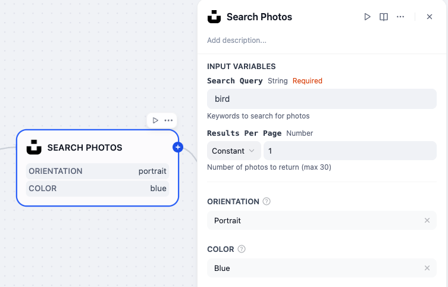
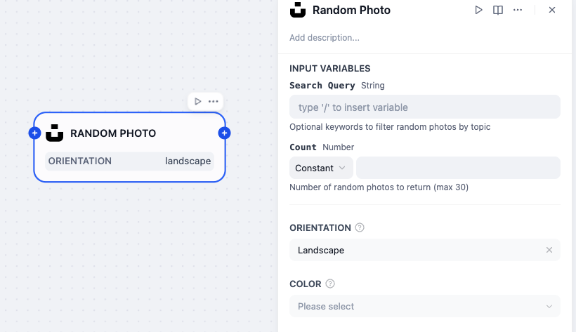

# Unsplash Plugin

**Author:** [Steven Lynn](https://github.com/stvlynn)
**Version:** 0.0.1
**Type:** extension

## Description

This plugin provides integration with Unsplash API to search and retrieve high-quality photos. It includes two main tools:
1. **Unsplash Search Tool**: Search for photos by keywords with optional filters
2. **Unsplash Random Tool**: Get random photos with optional filters

## Features

- Search Unsplash photos by keywords
- Get random photos from Unsplash
- Filter results by orientation and color
- Download photos directly in your workflow
- Detailed photo metadata including dimensions, author info, and license

## Installation

1. Install the plugin from Dify Marketplace
2. Navigate to **Plugins** section in your Dify workspace
3. Find the "Unsplash" plugin and click "Install"
4. Configure your Unsplash API credentials

## Configuration

You need to provide your Unsplash API access key in the plugin credentials:
1. Go to Plugin settings
2. Add your Unsplash API access key
3. Save the configuration

## Usage

### Search Tool Parameters

- **query** (required): Search keywords
- **per_page** (optional): Number of results per page (1-30, default 10)
- **orientation** (optional): Filter by orientation (landscape, portrait, squarish)
- **color** (optional): Filter by hex color code

### Random Tool Parameters

- **count** (optional): Number of random photos (1-30, default 1)
- **query** (optional): Filter by keywords
- **orientation** (optional): Filter by orientation
- **color** (optional): Filter by color

## License

[MIT License](./LICENSE)

## Feedback and Issues

If you encounter any problems or have suggestions for improvements:

1. Please open an issue in the [plugin's GitHub repository](https://github.com/stvlynn/Unsplash-Dify-Plugin/issues)

2. Provide details about your problem, including error messages and steps to reproduce

3. **Do not** submit issues to the main [Dify](https://github.com/langgenius/dify) repository for plugin-specific problems

